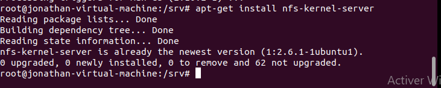
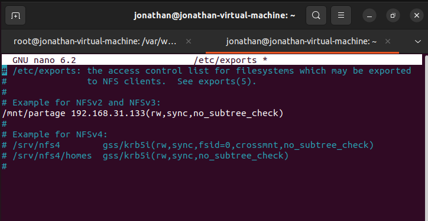
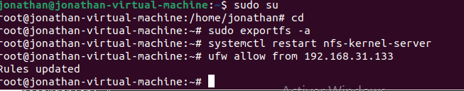
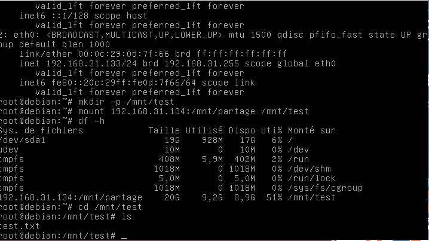

# Mise en place d'un serveur NFS
### A quoi sert NFS?
##### Network File System (NFS), ou système de fichiers en réseau, est une application client/serveur qui permet à un utilisateur de consulter et, éventuellement, de stocker et de mettre à jour des fichiers sur un ordinateur distant, comme s'ils étaient sur son propre ordinateur.
#### Il est necessaire de passer en mode root pour les configurations suivantes
            il faut ajouter sudo pour chaque commandes sinon passer en mode root par sudo su

##            Côté serveur
### 1-Installation du packet
        -root@jonathan:~# apt-get update
        -root@jonathan:~# apt install nfs-kernel-server

### 2-Creer le repertoire de partage
        -root@jonathan:~# mkdir /mnt/partage
### 3-Configurer le repertoire /etc/exports
        -root@jonathan:~# nano /etc/exports
Ajouter le ligne suivante:
        /chemin du partage/  adresse IP du client(rw,all_squash,sync,no_subtree_check)
        
        ici,ce sera /mnt/partage/ 192.168.31.133/24(rw,all_squash,sync,no_subtree_check)

Pour cette configuration,
rw : permet la lecture et l'écriture sur un partage pour l'hôte défini (par défaut, les partages sont en mode ro; c'est-à-dire en lecture seule).  
sync : est le contraire de async. Le serveur NFS respecte le protocole NFS.  
all_squash : force le mapping de tous les utilisateurs vers l'utilisateur anonyme.  
no_subtree_check : Cette option neutralise la vérification de sous-répertoires, ce qui a des subtiles implications au niveau de la sécurité, mais peut améliorer la fiabilité dans certains cas.
 

### 4-relancer le service
        root@jonathan:~# service nfs-kernel-server reload
##### Pour verifier l'installation,
        root@jonathan:~# showmount -e
### 5-Utilisation des firewalls pour la machine cliente

#### Pour verifier l'acces,il faut s'assurer que le fichier test.txt s'affiche sur la machine cliente(Apres la configuration du côté client)
        

##       Côté client
### 1-Installation du packet
        root@debian:~# apt install nfs-common

### 2-se diriger vers le repertoire de partage
inserer la ligne suivante:
                showmount -e 192.168.31.134
Sortie attendue: Export list for 192.168.31.134 br
### 3-Créer le repertoire  de partage
        root@debian:~# mkdir -p /mnt/test
### 4-Monter le partage sur la machine cliente
        root@debian: mount 192.168.31.134:mnt/partage/  /mnt/test  

### 5-se diriger vers le repertoire de partage et tester l'accès du client
        root@debian:~# cd /mnt/test
        root@debian:~# mkdir test.txt
#### Vous avez  une serveur NFS fonctionelle.

<a href="https://github.com/Jonas4884/Reseau-et-systeme">Revenir au liste des serveurs</a>