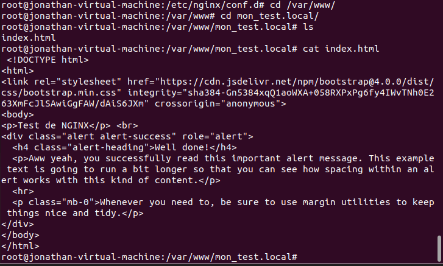
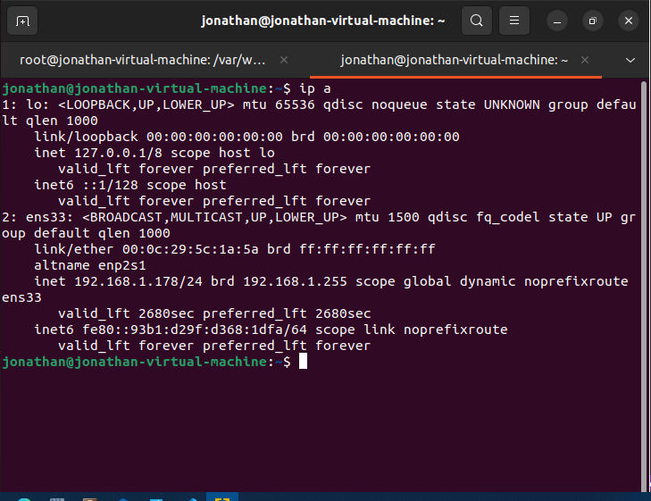
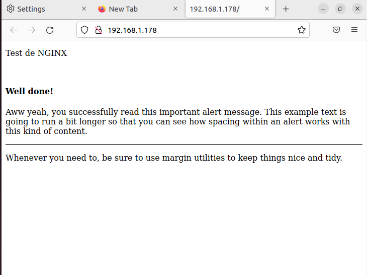

# Créer une serveur Nginx
# Pour toutes les configurations,il est exigé d'être en mode root:

## 1-Installer Nginx sur un systeme basée sur linux(Debian/Ubuntu)
  Commande:
        -apt-get update  
        -apt-get install nginx
  ### Pour verifier:
        -nginx -v

## 2-Configuration du serveur
  Commande:  
            -root@jonathan:~# nano /etc/nginx/conf.d/test.local.conf  
   Ajouter les configurations: 

Dans ses configurations,  
            -listen 80 redirige le port d'ouverture sur le port 80  
            -Ces fichiex index configure le support de fichier lors du lancement du serveur  
            -root  /var/www/mon_test.local est le repertoire de fichier du serveur.  

## 3-Configuration du serveur - sites disponible et liens symboliques
            -root@jonathan:~# cd /var/www/mon_test.local
            -root@jonathan:~# nano index.html
Comme toutes les pages html,on peut mettre des balises HTML commme ci-dessous:  

## 4-Redemarrer le service Nginx

            -root@jonathan:~# /etc/init.d/apache2 restart
## 6-Récuperer l'adresse IP et le saisir sur un navigateur.
            -root@jonathan:~# ip addr

### Vous avez une serveur Nginx fonctionnelle

 
<a href="https://github.com/Jonas4884/Reseau-et-systeme">Revenir au liste des serveurs</a>