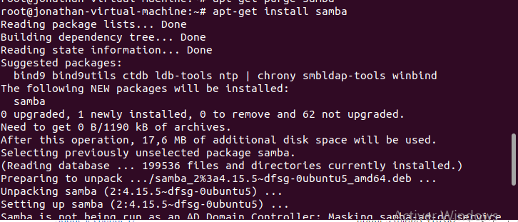
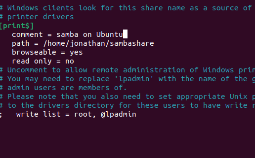
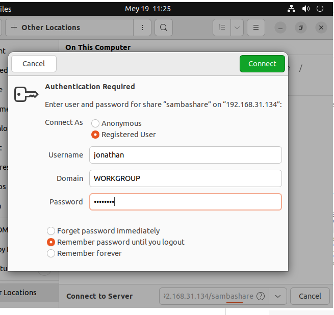
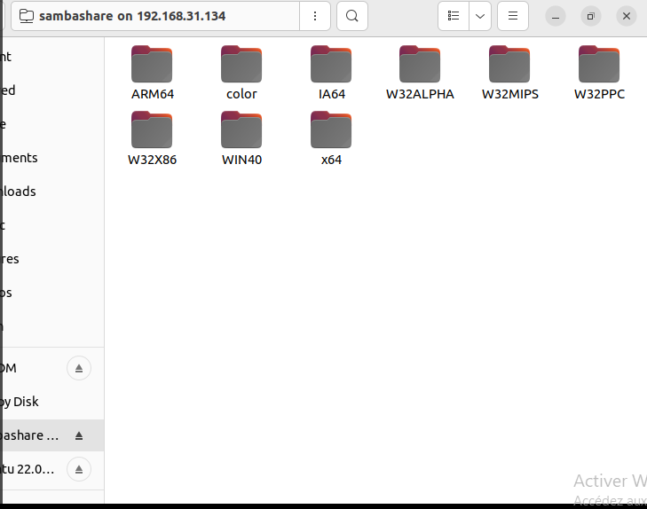

# Tutoriel d'installation du serveur Samba
## A quoi sert un serveur samba
Un serveur de fichiers Samba permet le partage de fichiers entre différents systèmes d’exploitation sur un réseau. Il vous permet d'accéder aux fichiers de votre bureau depuis un ordinateur portable et de partager des fichiers avec les utilisateurs de Windows et macOS.
## Dans tout les configuration,il faut tout d'abord disposer d'une connexion internet

## 1)Créer deux machines virutelles sous VMWare ou similaire(VirtualBox) à base du noyau Linux

## 2)Configurer les adresse IP
 Machine serveur:198.168.31.134
 Machine client:adresse IP par  le commande root@user:~# ifconfig

Machine serveur
  ### 2.1 Configuration:
     Commande: root@user:~# nano /etc/network/interfaces
Configuration:
 #This files describes the network interfaces available on your system
 #and how to activate them. For more information,see interfaces(5)
 
 source /etc/network/interfaces.d/*  
 #The loopback network interface  
 auto lo  
 iface lo inet loopback  
 address 192.168.31.134  
 netmask 255.255.255.0  

=>Enregister ses configurations

  ### 2.2 redemarrer le service de réseausamba-success.png

      commande:root@user:~# /etc/init.d/networking restart
  
## 3. Installation des packages respectifs
		Machine serveur
		  *Avec internet
			commandes: root@user:~# apt-get install samba

## 4. Configurer le Nom du groupe
   commande: root@user:~# nano /etc/samba/smb.conf  
	configuration:  
  ....  
   ================ Global Settings ================  
  [global]
   #Browsing/Identification
   #### Change this to the workgroup/.......
     workgroup = Etudiant
     Server string = HEI
   #....  
=>Enregistrer ses modifications

  
## 5. Creer le repertoire de partage
  Commande : root@user:~# mkdir /home/user/partage

## 6. Partager ce dossier via samba

  ===================== Share Definition ===============  
 ....
 [partage]
 comment = SambaShare  
  browseable = yes  
  writable = yes  
  path = /home/user/sambashare  
  

  =>Enregistrer la modification
## Redémarrer le service
    root@user:~# /etc/init.d/samba restart
## 7.Tester l'accès au partage depuis la machine physique(Windows/Linux)
   #Ouvrir l'exporateur de fichier
   #Ouvrir la section réseau
   #A la fin du chargement,entrer ceci sur la barre de navigation:
		\\192.168.31.134 (Adresse IP du machine serveur)

## 8. Creer  un compte samba
   commande: root@user:~# adduser jonathan  
	     root@user:~# smbpasswd -a jonathan  
   New SMB password: passetude  
   Retype new SMB password: passetude  
   Added user jonathan  
 
## 9.Ressayer d'acceder à ce partage depuis la machine physique
    #Pour Windows
    #Ouvrir l'exporateur de fichier
    #Ouvrir la section réseau
    #A la fin du chargement,entrer ceci sur la barre de navigation:
		\\192.168.31.134 (Adresse IP du machine serveur)
    #Pour Linux,entrer:
      smb://192.168.31.134/sambashare
   Sur le nom utilisateur,il faut entrer le nom d'utilisateur samba  
     Ici,c'est l'utilisateur "jonathan"
   Mot de passe:passetude
   
   
  

 ## Coté client

## 1.Tester l'accès au partage depuis la machine cliente
	commande -root@debian:~# smbclient -L 192.168.31.134 -U jonathan
                 Enter jonathan's password:passuser
###### Ici l'adresse 192.168.10.250 est l'adresse IP du serveur et jonathan est l'utilisateur samba du coté serveur
		 -root@Debian:~# smbclient //192.168.31.134/sambashare

  
  
Et ainsi,la liaison entre Windows-machine serveur-machine client s'etablie
 Pour recevoir un fichier sur les machines,on peut utiliser "get fichier.txt"
 Pour creer un fichier sur les machines,on peut utiliser "put fichier.txt" 
     
              

   
 
