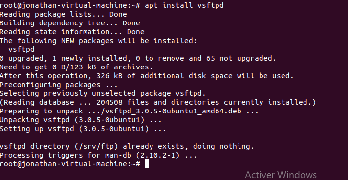
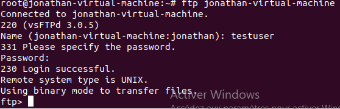
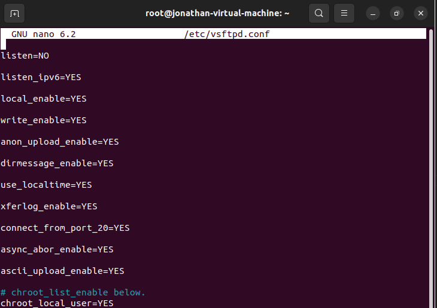
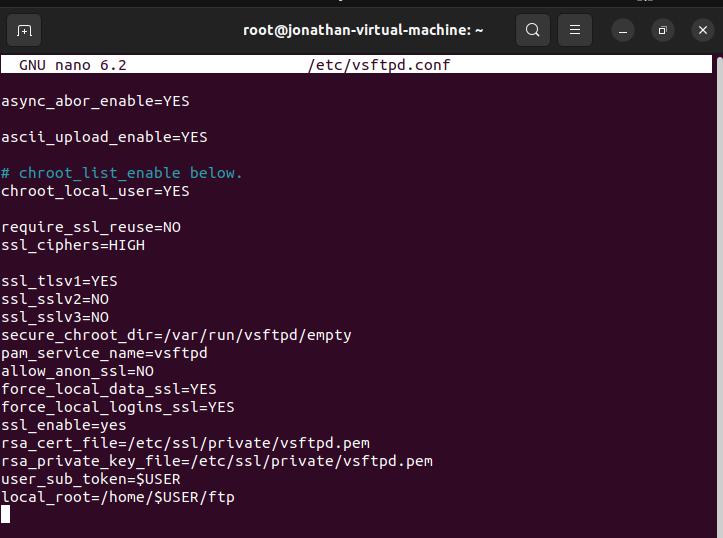
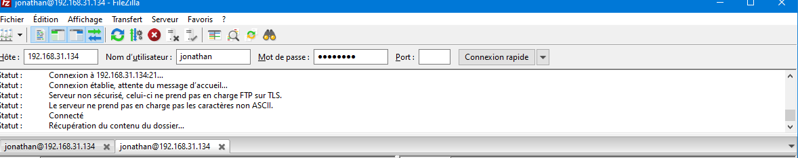

# Installation du serveur vsftpd
### A quoi sert Vsftpd
#### Vsftpd est un serveur FTP libre. Il permet de transférer des fichiers par Internet ou par le biais d'un réseau informatique local (intranet).Toute personnes en ayant l'autorisation, peut télécharger et envoyer des fichiers. Il permet la création d'un espace anonyme.

##### Pour cette serveur, il nous faut deux machines pour simuler la connexion Client-Serveur.

#### Côté serveur
##### 1-Installation du packet vsftpd
    root@jonathan:~# apt-intsall vsftpd -y
    
##### 2-Verifier l'installation
    root@jonathan:~# vsftpd -v
##### 3-Premier test

##### 4-Creer un nouvel utilisateur
        root@debian:~# adduser jonathan
Ajouter une mot de passe
        root@debian:~# passwd jonathan
##### 4-Configuration de vsftpd.conf
Inserer ou modifier les lignes concerenées :

##### 6-Relancer le service Vsftpd
        root@jonathan:~# systemctl restart vsftpd
#### Côté client
#####  Introduire l'adresse IP du serveur dans la machine cliente
#####      -ouvrir le repertoire travail/partage via fileZilla ou similaire
                Entrer l'adresse IP du serveur et puis Connexion rapide

### Vous êtes sur le repertoire du partage de fichier via FTP

<a href="https://github.com/Jonas4884/Reseau-et-systeme">Revenir au liste des serveurs</a>
